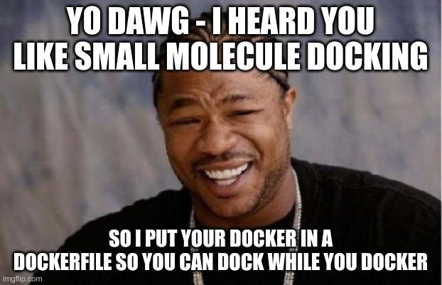

# quarantineAtHome

### About

quarantine@Home is a distributed computing project (like SETI@home) to fight the COVID19 viral pandemic.
 Other efforts like [Folding@home](https://foldingathome.org/2020/03/15/coronavirus-what-were-doing-and-how-you-can-help-in-simple-terms/) and [Rosetta@home](https://www.ipd.uw.edu/2020/02/rosettas-role-in-fighting-coronavirus/) are conducting important experiments as well.
 
 This project is conducting a different kind of experiment. Instead of folding large proteins, we are docking small molecule compounds to proteins that are important for the infection. The software we are using is [Autodock](http://autodock.scripps.edu/)
 
 Small molecules are taken from the UCSF [Zinc](https://zinc.docking.org/) database, which has conveniently divided these ligands into "tranches" based on their physical properties. To minimize load on the database, clients are programmed to download and compute single tranches at a time.

This project is being written in Dockerfiles, to allow the ease of distributing work.

### Building and running

If you want your username to appear in the leaderboards, change "anonymous" below

##### CPU users :
This uses the standard version of AutoDock4.

    sudo docker build -t quarantine -f Dockerfile .
    sudo docker run -it -e ME=anonymous quarantine

##### GPU users (much faster!) :
You will need to have nvidia-docker installed. This will run a [GPU-optimized version of Autodock](https://github.com/ccsb-scripps/AutoDock-GPU) 

    sudo docker build -t quarantinegpu -f Dockerfile.gpu .
    sudo nvidia-docker run -it -e ME=anonymous quarantinegpu
    
Need nvidia-docker? [this is the best tutorial on how to install it](https://medium.com/@sh.tsang/docker-tutorial-5-nvidia-docker-2-0-installation-in-ubuntu-18-04-cb80f17cac65)

##### Why Docker ?

I'm no docker fanatic, but this needs to be portable to make it easier for participants to easily contribute. Installing the base packages is quite laborious.

Also, we're going to try using [boinc2docker](https://github.com/marius311/boinc-server-docker/blob/master/docs/cookbook.md) to deploy this on all systems

