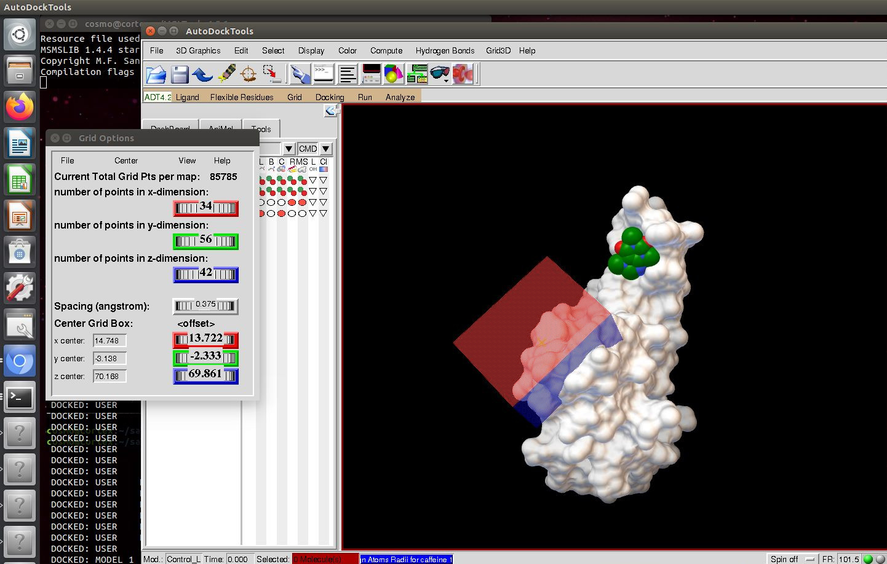

# quarantine-receptors
This repository holds the receptor model systems in individual subdirectories. The docking client will periodically pull this repository, and dock ligands to each system.

Why a github repository? Because I trust their uptime more than my own.

## mpro-1

This is the "Mpro" protease of Sars-cov2, whose structure was recently determined and released by the Walsh group :

https://twitter.com/MartinWalshDLS/status/1236355083585179648

The docking task is to find small-molecule binders of the active site.

### Model systems

##### Sars-cov2 Spike protein
Ideally, if we found small molecules that bind to the contact surface between spike protein and human ACE2, we may block its spread in the body,

