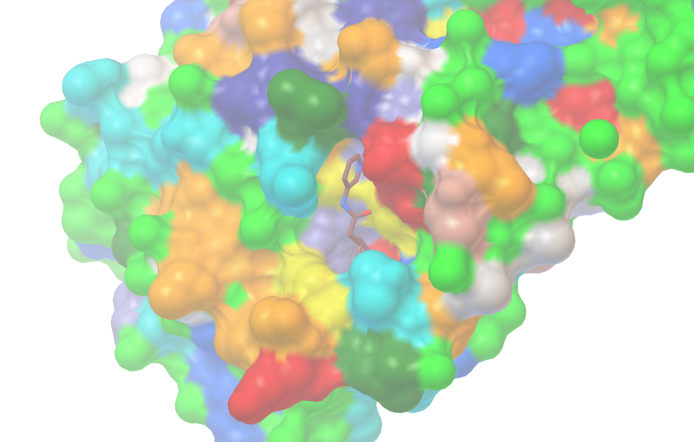

[receptors](../)

##### Sars-cov2 protease Mpro-1
This is the main protease of the coronavirus. You can learn more about it at [RCSB](http://pdb101.rcsb.org/motm/242)

This particular structure is based on a recent [fragment screening](https://twitter.com/MartinWalshDLS/status/1236355083585179648) experiment.

